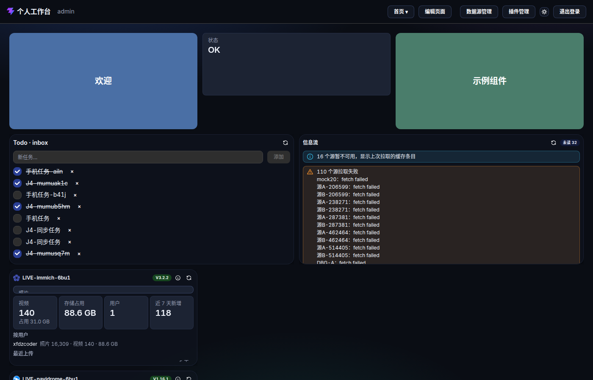
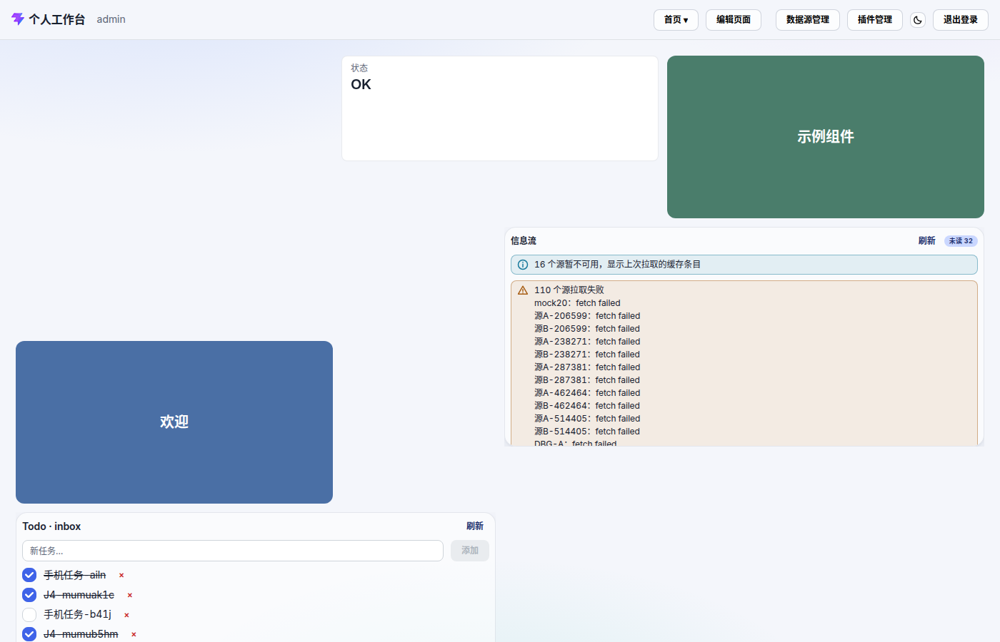

# 个人工作台（all-in-one）

[](https://github.com/xfdzcoder/all-in-one/actions/workflows/ci.yml)
[](https://github.com/xfdzcoder/all-in-one/actions/workflows/docker.yml)
[](LICENSE)


自研个人工作台（Personal Workbench）：把散落的自建服务与常用工具收进**一个可配置的桌面**——
Dashboard 布局自由拖放、组件由 manifest 声明、数据归 Workspace、凭证进加密仓库、第三方出站统一走服务端 connector。

> 项目处于早期开发阶段（MVP 已完成、自主迭代中）；单用户设计，schema 已为多用户预留。

| | |
|---|---|
|  |  |

## ✨ 特性

**16 个内置组件**（组件 = manifest + configSchema 声明，插件走同一契约，见 [`packages/widget-sdk`](packages/widget-sdk/README.md)）：

| 分类 | 组件 |
|---|---|
| 效率 | 个人 Todo · 看板 · RSS 聚合（未读标记归 Workspace） |
| 服务聚合 | 应用入口（HTTP/TCP 存活探测）· 服务概览（探活 + 版本 + 关键计数）· 嵌入页面（iframe 沙箱 + 禁嵌检测） |
| 自建服务 | Immich 照片墙 · Navidrome 专辑墙 · Portainer 容器清单（含日志尾部）· Mihomo 节点面板 · 服务器监控（Glances 等） |
| 数据 | 自定义 API（服务端代取 + 模板渲染）· 图表（ECharts 折线/柱状/饼图，HTTP 快照或 WS 实时流）· 指标卡片 |
| 通信 | 邮件聚合（IMAP / Gmail OAuth，只读） |
| 其它 | 占位组件（标题 + 配色） |

**架构要点**

- **数据与布局分离**：Workspace 拥有数据、Dashboard 只拥有布局、组件实例 = 视图 + 配置；删页面/删组件绝不删业务数据。
- **凭证加密仓库**：第三方凭证 AES-256-GCM 加密存储（主密钥来自环境变量），不落前端明文、不入日志。
- **统一出站**：第三方请求全部走服务端 connector，带限流/超时/体积上限，**默认拒绝内网目标**（SSRF 基线，可显式放行）。
- **自由布局**：gridstack 驱动拖放/缩放/断点，桌面端编辑、移动端浏览。
- **外观可定制**：主题令牌、明暗色、自定义 CSS 编辑器（带高亮/提示/历史备份）。

## 🐳 Docker 快速开始

```bash
git clone https://github.com/xfdzcoder/all-in-one.git
cd all-in-one

# 1) 口令：首启创建初始账号（D17）
export ADMIN_PASSWORD='你的口令'
# 2) 凭证加密主密钥（base64 32 字节）—— 生成后请另行备份，丢失即已存凭证无法解密
export CREDENTIALS_MASTER_KEY=$(node -e "console.log(require('crypto').randomBytes(32).toString('base64'))")

docker compose up -d --build
```

浏览器打开 `http://localhost:3000`，用户名 `admin`（可用 `ADMIN_USERNAME` 改）。数据落在 `./data`（SQLite 库文件 + 插件 + 备份落点），升级/重启不丢。

Release 之后也可直接拉取 GHCR 镜像（首个 `v*` tag 上架）：

```bash
docker run -d --name all-in-one -p 3000:3000 \
  -e ADMIN_PASSWORD='你的口令' \
  -e CREDENTIALS_MASTER_KEY='你的主密钥' \
  -v "$PWD/data:/app/data" \
  ghcr.io/xfdzcoder/all-in-one:latest
```

### ⚙️ 环境变量

| 变量 | 说明 | 默认 | 必填 |
|---|---|---|---|
| `ADMIN_PASSWORD` | 首启创建初始账号的口令 | — | **首启必填**（账号已存在后不再读取） |
| `ADMIN_USERNAME` | 初始用户名 | `admin` | 否 |
| `CREDENTIALS_MASTER_KEY` | 凭证加密主密钥（base64 解码后恰 32 字节） | — | **必填** |
| `COOKIE_SECURE` | 会话 cookie 带 `Secure`；公网/HTTPS 部署**必须**置 `1` | `0` | 公网必置 |
| `ALLOW_PRIVATE_OUTBOUND` | custom-api / 邮件组件以本机或内网服务为目标时置 `1`（其余组件本就放行内网） | `0` | 否 |
| `LOG_LEVEL` | `debug` \| `info` \| `warn` \| `error` | `info` | 否 |
| `GMAIL_CLIENT_ID` / `GMAIL_CLIENT_SECRET` | Gmail OAuth 客户端（可选，见 [`docs/deploy.md`](docs/deploy.md)） | 空 | 否 |

镜像内已固定 `DATABASE_URL=file:/app/data/app.db`、`PUBLIC_DIR=/app/public`、`HOST=0.0.0.0`（裸跑 server 才需要自行设置）；**没有 `DATA_DIR`**，数据目录由 `DATABASE_URL` 决定。完整说明与公网化前必做清单见 [`docs/deploy.md`](docs/deploy.md)。

### 💾 备份 / 恢复

```bash
# 备份（任意时刻）：SQLite(WAL) + 插件 + 自定义 CSS 都在 ./data
tar czf backup-$(date +%F).tar.gz ./data
# 恢复：停容器 → 解压 ./data → 启动容器
```

⚠️ `CREDENTIALS_MASTER_KEY` 与备份分开保存：主密钥丢失 = 已存凭证永久无法解密。
数据库迁移为 up-only、无自动回滚，回退方案见 [`apps/server/drizzle/README.md`](apps/server/drizzle/README.md)。

## 🛠 本地开发

```bash
pnpm install                 # 包管理器固定 pnpm@12.6.0
export ADMIN_PASSWORD='你的口令'
export CREDENTIALS_MASTER_KEY=$(node -e "console.log(require('crypto').randomBytes(32).toString('base64'))")
pnpm dev                     # web :5173（代理 /api）+ server :3000
```

常用命令：`pnpm build` / `pnpm test` / `pnpm typecheck` / `pnpm lint`（oxlint + knip 门禁）。
UI 行为验收：`pnpm verify list` / `pnpm verify smoke`（puppeteer-core + 系统 Chrome，需 server :3000 + preview :4173）。

## 📦 仓库结构

| 路径 | 职责 |
|---|---|
| `apps/web` | 前端宿主：布局引擎（gridstack，**只在这里封装**）、组件渲染、数据源管理 |
| `apps/server` | API / 鉴权 / 数据通道 / connector / 凭证加密仓库 / 迁移（drizzle-kit 生成，勿手写 DDL） |
| `packages/widget-sdk` | Widget 契约（manifest / configSchema / 插件 ABI / 受限 JSX / ServiceOverview）——**扩展规范见其 README** |
| `docs/` | 需求决策、部署、交互文档、质量体检 |
| `apps/web/scripts/` | verify/capture 脚本（布局与数据快照还原守卫，不污染开发库） |

## 📚 文档

| 文档 | 内容 |
|---|---|
| [`docs/feature-plan/`](docs/feature-plan/) | 需求与技术决策的唯一事实来源（需求 / 决策日志 ADR / 技术分析 / 里程碑 / 路线图 / 组件质量门禁） |
| [`docs/deploy.md`](docs/deploy.md) | 部署、备份恢复、Gmail OAuth、公网化前必做、日志 |
| [`docs/interaction/`](docs/interaction/) | 交互逻辑权威描述（页面 / 组件 / 交互面三级 + 按钮总索引） |
| [`docs/design-audit/`](docs/design-audit/) | 视觉规范与自定义 CSS 契约 |
| [`docs/quality-audit/`](docs/quality-audit/) | 全库质量体检报告与问题台账 |

## 🔐 安全须知

- 凭证加密存储、日志自动脱敏、出站默认拒绝内网目标（SSRF 基线）。
- **公网化部署前必做**（否则有会话劫持与滥用风险）：HTTPS 反代终止 TLS、`COOKIE_SECURE=1`、速率限制与审计日志——清单见 [`docs/deploy.md`](docs/deploy.md) 与 [`docs/feature-plan/06-roadmap.md`](docs/feature-plan/06-roadmap.md)。
- 发现安全问题请走 GitHub 的 Private Vulnerability Reporting（见 [`SECURITY.md`](SECURITY.md)）。

## 🗺 路线图

近期与远期规划（含公网化、多用户）见 [`docs/feature-plan/06-roadmap.md`](docs/feature-plan/06-roadmap.md)。

## 🤝 参与

欢迎 Issue 与 PR。提交前请过 `pnpm test` / `pnpm typecheck` / `pnpm lint`，
并阅读 [`CONTRIBUTING.md`](CONTRIBUTING.md) 与 [`AGENTS.md`](AGENTS.md)（架构不变量与开发约定）。

## 📄 License

[MIT](LICENSE) © 2026 xfdzcoder
