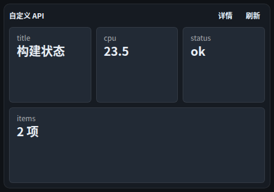
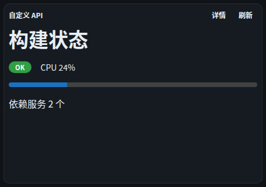

# 组件 · 自定义 API

> 层级：页面 → 组件 → 按钮。约定见 [../README.md](../README.md)；问题见 [../00-issues.md](../00-issues.md)。
> FR：配置 URL/鉴权/展示模板；请求由**服务端代取**（FR-W3，凭证不落前端）。展示模板走受限 JSX（**D35** Homarr 模式）。

**截图**： · 

## 配置（configSchema）

| 字段 | 类型 | 默认 | 说明 |
|---|---|---|---|
| `url` | text（必填） | — | 接口地址 |
| `method` | select | GET | GET/POST… |
| `display` | select | `stat` | stat 统计卡 / list 列表 / status 状态灯 / raw 原始 JSON / jsx 模板 |
| `templateJsx` | textarea | — | 受限 JSX 模板（display=jsx 时；D35：组件白名单 + 安全绑定 + 危险标识符拒绝） |
| `path` | text | — | 取值点路径（如 `data.items`，可空） |
| `labelField` / `valueField` | text | name / value | stat/list/status 的字段映射 |
| `statusField` | text | — | status 模板：该字段真值 = 绿点 |
| `apiToken` | secret | — | 访问令牌（入凭证库 SEC3） |
| `authHeader` | text | Authorization | 认证头名（空 = `Authorization: Bearer …`） |
| `refreshSec` | number | 60 | 标准刷新字段 |

## 数据流

```
POST /api/widgets/data { type:"custom-api", config:{…} }
  ──► http connector（服务端代发，SSRF 基线 SEC4）──► 响应 → path 取值 → 展示模板渲染
```

## 交互点

### 展示区（按 display）

| 模板 | 表现 |
|---|---|
| `stat` | 统计卡网格（`.wb-stat-grid`）：标签在上/数值大；嵌套值转「n 项/n 字段」+摘要（不 JSON dump） |
| `list` | 表格：标题字段 / 数值字段（前 20 行） |
| `status` | 行：绿/红圆点 + 标题字段 |
| `raw` | 等宽 JSON（只读） |
| `jsx` | 按受限模板渲染（D35）；模板被拒 → 红色 `WbAlert`「模板错误（D35 校验拒绝）：{原因}」 |

### 按钮 · 详情

- **触发**：弹窗「详情 · 完整响应（FR-I4）」——完整 JSON（等宽 `.wb-code`）。
- **弹窗内**：「复制 JSON」→ 剪贴板 → 「已复制」。

### 按钮 · 刷新

- **触发**：force 回源。

## 状态与边界

| 状态 | 表现 |
|---|---|
| 加载中 | 「加载中…」 |
| 无数据 | 「无数据」 |
| 错误 | `WbAlert`（error，sm） |
| 模板拒绝 | `WbAlert`（error，sm）列出全部校验错误 |

## 已知问题

——（Q19c 的 stat 重设计与 JSON 复制已收口；本轮走查无新增）
