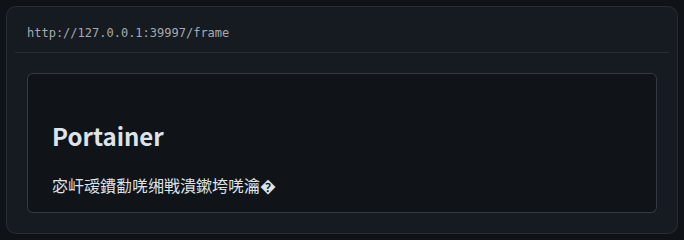

# 组件 · 嵌入页面（iframe）

> 层级：页面 → 组件 → 按钮。约定见 [../README.md](../README.md)；问题见 [../00-issues.md](../00-issues.md)。
> FR-J7：可配置 URL + 沙箱策略；目标站禁嵌时明确提示 + 逃生口（**D23**：服务端读响应头判定）。

**截图**：

## 配置（configSchema）

| 字段 | 类型 | 默认 | 说明 |
|---|---|---|---|
| `url` | text（必填） | — | 嵌入地址（如 `http://192.168.31.133:9000`） |
| `sandbox` | text | 空 = `allow-scripts` | 沙箱能力（可加 `allow-same-origin`，用户知情放开） |

## 数据流

```
POST /api/widgets/data { type:"iframe-embed", config:{ url } }
  ──► iframe-embed connector：逐跳出站读响应头（X-Frame-Options / CSP frame-ancestors）
      → { verified, embeddable, reason }（SEC4 SSRF 基线）
```

浏览器禁嵌时 **load 事件照常触发**（载入错误页）——前端无法自判，故服务端判定（D23）。

## 交互点

### 头部 · URL 徽标

- **表现**：小号次级等宽文本（`.wb-url`），truncate。

### 提示条 · 无法嵌入此页面（禁嵌时）

- **触发**：connector 判定 `embeddable=false` 时显示。
- **内容**：「目标站点禁止被嵌入（{原因，如 X-Frame-Options}）。请 [在新标签页打开] ，或在目标服务的设置中允许嵌入当前地址。」
- **逃生口**：「在新标签页打开」新标签打开目标（J7 验收点）。
- **帧处理**：iframe **保留在 DOM 但视觉隐藏**（`.wb-frame__el--hidden`，隐藏判定读元素自身 display）。

### 帧区

- **加载态**：`onLoad` 前显示居中 Loader；帧区有边框 + 圆角（`.wb-frame`，P2-7 修复）。
- **沙箱**：`sandbox={sandboxAttr}` —— 默认最小集 `allow-scripts`（禁同源/顶层导航/表单弹窗）；空字符串会绕过默认 → 回落 `allow-scripts`（Q2 结论）。

## 状态与边界

| 状态 | 表现 |
|---|---|
| 未配 url | 「配置 url 后显示嵌入页面」 |
| 加载中 | Loader |
| 禁嵌 | 警告条 + 逃生口 + 帧隐藏 |
| 加载失败 | 浏览器内置错误页（前端无感） |

## 已知问题

——（本组件走查未发现新问题；禁嵌帧隐藏的 DOM 语义见 D23/J7）
