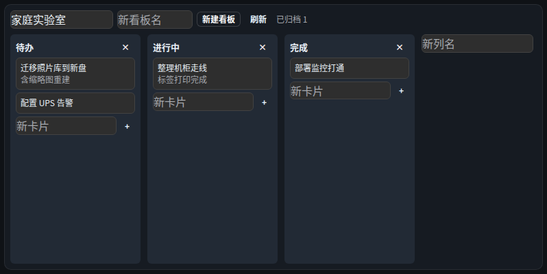

# 组件 · 看板（Kanban）

> 层级：页面 → 组件 → 按钮。约定见 [../README.md](../README.md)；问题见 [../00-issues.md](../00-issues.md)。
> FR：多项目看板（列/卡片）、卡片操作（编辑/移动/归档/删除）、拖拽手势专门设计（**D29**）。

**截图**：

## 配置（configSchema）

| 字段 | 类型 | 默认 | 说明 |
|---|---|---|---|
| `boardId` | 组件内写回 | — | 头部「看板选择」写入（**D28**：组件内配置写回 + requestSave），非表单字段 |
| `refreshSec` | number | 60 | ≥10 标准刷新字段 |

## 数据流

```
GET /api/kanban/boards ──► 看板列表
GET /api/kanban/boards/:id ──► 树（columns + cards）
POST/PATCH/DELETE board/column/card ──► SSE「kanban」──► 全部看板组件刷新
```

数据归 Workspace（D21）：多个看板组件选同一 boardId 即共享（J4 同款语义）。

## 结构

| 区块 | 内容 |
|---|---|
| 头部 | 看板选择（Select）/ 新看板名 / 「新建看板」/「刷新」/「已归档 N」 |
| 列区 | 每列：标题（点击编辑）/「×」删列 / 卡片堆 / 新卡片行 |
| 弹层 | 卡片编辑（标题/描述/移动到/保存/归档/删除） |

## 交互点

### 选择器 · 看板选择（配置写回）

- **触发**：下拉选看板 → `grid.update(node, { props: { boardId } })` + requestSave（D28）→ 组件重查该看板树。
- **状态与边界**：空库显「暂无看板」；编辑态内容 inert（D38）不可操作。
- **无障碍**：`aria-label="看板选择"` ✓。

### 输入框 · 新看板名 + 按钮 · 新建看板

- **触发**：Enter 或点击 → `POST /api/kanban/boards { title }` → 刷新列表 → **自动选中新看板**。
- **状态与边界**：⚠ ISS-21：空名静默 return（按钮不禁用，同 ISS-2 模式）。

### 按钮 · 刷新

- **触发**：force 回源（FR-I3）。

### 列 · 标题（点击编辑）

- **触发**：点击文本 → 变输入框（autoFocus）→ Enter/失焦提交 `PATCH /api/kanban/columns/:id { title }`；Esc 取消。
- **状态与边界**：hover 提示「点击重命名」；列容器 `data-col-title` 为自动化锚点。
- **⚠ ISS-19**：文本点击进入编辑无键盘入口（同模式）。

### 按钮 · ×（删列，破坏性）

- **触发**：二次确认（D31/D34）：「删除列？」+ 正文点名列名与**将删除的卡片数**、不可恢复。
- **确认后**：级联删除该列卡片（服务端级联）→ SSE 同步。
- **数据边界**：仅删该列与其中卡片；其它列/看板不动。

### 卡片（拖拽 + 点击编辑）

- **拖拽（D29，仅浏览态）**：`draggable` HTML5 DnD → 拖动时**目标列整列高亮**（虚线强调）+ 列尾「放在这里」占位框 → 落到**列内任意空白处**即移至该列末尾（`sortOrder = max+1`）；dragEnd/移出清态。
- **点击**：打开卡片编辑弹窗。
- **编辑态**：卡片不可拖（inert + 让位布局拖拽）；可用弹窗内「移动到」完成移动（触控/键盘备选）。
- **⚠ ISS-19**：卡片 div 点击无键盘可达性。

### 弹层 · 卡片编辑

| 控件 | 行为 |
|---|---|
| 标题（文本框） | 编辑卡片标题 |
| 描述（多行） | 编辑正文 |
| 移动到（Select） | 选择即移动到目标列末尾并**关闭弹窗**（与拖拽同路径 moveCardTo） |
| 保存 | `PATCH card { title, body }` → 关弹窗 |
| 归档 / 取消归档 | `PATCH card { archived }` → 关弹窗 |
| 删除（ConfirmAction） | 确认弹窗「删除卡片？」→ `DELETE card` |

- **⚠ ISS-13（逻辑 P1）归档后无法恢复**：归档卡片从列中移除（`cardsOf` 过滤 archived），仅头部显示「已归档 N」计数 —— **没有任何入口列出归档卡片**，「取消归档」按钮只存在于卡片编辑弹窗，而归档卡片不可点击 → 死路径。恢复只能改数据库。

### 输入行 · 新卡片

- **触发**：列内输入 + Enter（或「+」按钮）→ `POST card { columnId, title }` → 列刷新。
- **状态与边界**：⚠ ISS-21：空名静默；输入框 placeholder「新卡片」为自动化锚点。

## 状态与边界

| 状态 | 表现 |
|---|---|
| 未选看板 | 「选择或新建看板后显示列与卡片」 |
| 加载中 | 「加载中…」 |
| 编辑态 | 提示「编辑模式：拖动 = 调整布局，卡片暂不可拖…」（组件内唯一有编辑提示的，全局反而没有 ⚠ ISS-11） |
| 错误 | `WbAlert`（error，sm） |

## 已知问题

~~ISS-13~~ ✅ 已修（Q24a：归档列表可恢复/删除）· ⚠ ISS-19（逻辑 P2）标题/卡片键盘不可达 · ⚠ ISS-21（逻辑 P2）空输入静默
