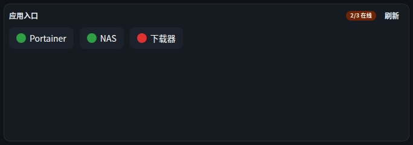

# 组件 · 应用入口 + 服务状态

> 层级：页面 → 组件 → 按钮。约定见 [../README.md](../README.md)；问题见 [../00-issues.md](../00-issues.md)。
> FR：图标网格（现为药丸行）、HTTP/TCP 存活探测、点击跳转。

**截图**：

## 配置（configSchema）

| 字段 | 类型 | 默认 | 说明 |
|---|---|---|---|
| `itemsJson` | json（必填） | — | `[{"name":"Portainer","url":"http://…:9000","probe":"http"}]`；`probe: http\|tcp` |
| `refreshSec` | number | 120 | ≥30 标准刷新字段 |

## 数据流

```
POST /api/widgets/data { type:"app-launcher", config:{ itemsJson } }
  ──► launcher connector：逐项 HTTP/TCP 探活（服务端代探，SEC4 内网出站策略）
```

## 交互点

### 药丸行 · 服务项（点击跳转）

- **结构**：每项：服务名 + 存活圆点（绿=在线 / 红=离线）。
- **触发**：点击 → 新标签页打开 `url`（`<a target="_blank" rel="noopener noreferrer">`，语义安全 ✓ 键盘可聚焦 ✓）。
- **状态与边界**：离线仍可点（跳转是用户意图，探活仅展示）。
- **⚠ ISS-20（样式 P2）**：无服务图标、行稀疏（Q19a P2 遗留未覆盖）——与「图标网格」的 FR 描述有落差。

### 按钮 · 刷新

- **触发**：force 重探（FR-I3）。

## 状态与边界

| 状态 | 表现 |
|---|---|
| 探测中 | 「探测中…」 |
| 空态 | 「在配置里填入服务列表」 |
| 错误 | `WbAlert`（error，sm） |

## 已知问题

⚠ ISS-20（样式 P2）药丸无图标、与 FR「图标网格」有落差
