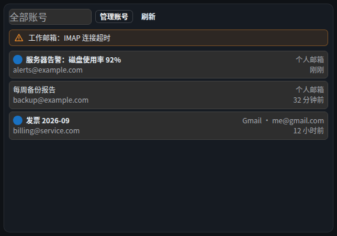

# 组件 · 邮件（只读聚合）

> 层级：页面 → 组件 → 按钮。约定见 [../README.md](../README.md)；问题见 [../00-issues.md](../00-issues.md)。
> FR：多账号只读聚合（D3 只读边界：无发送/删除/标记端点）；正文不可信 → 沙箱渲染（D30/D25）。Gmail 经 OAuth（D37）。

**截图**：

## 配置（configSchema）

| 字段 | 类型 | 默认 | 说明 |
|---|---|---|---|
| `accountIds` | multiselect（动态） | — | **展示的邮箱**多选（Q29e/四.2）；留空=全部；组合倒序（最新在前） |

## 数据流

```
GET /api/mail/accounts ──► 账号列表
GET /api/mail/messages?account=&limit= ──► 聚合列表（逐账号容错 + 60s 缓存）
GET /api/mail/messages/:account/:uid ──► 正文（体积截断）
POST/PATCH/DELETE /api/mail/accounts ──► 账号 CRUD（口令入凭证库 SEC3）
```

Gmail 账号（D37）：`refresh_token` 入凭证库，`messages.list/get` 只读。

## 结构

| 区块 | 内容 |
|---|---|
| 头部 | 账号过滤（Select）/「管理账号」/「刷新」 |
| 提示条 | 逐账号警告（黄）/ 总错误（红） |
| 列表 | 每行：未读点 / 主题 / 发件人 · 相对时间 / 账号名 |
| 弹层 | 邮件详情 / 账号管理 |

## 交互点

### 选择器 · 账号过滤

- **触发**：选择账号 → 列表只显该账号邮件；「清空」回全部。

### 按钮 · 管理邮箱

- **触发**：跳转「数据源管理 · 邮箱」（D42：邮箱属数据源，管理统一在管理页）。
- **弹窗内容**：
  - **添加账号表单**：名称 / 主机 / 端口（默认 993）/ 加密（ssl…）/ 用户名 / 文件夹（默认 INBOX）/ 口令（可空）→「添加账号」；失败显示表单级 `WbAlert`（error，sm）。
  - **Gmail 绑定**：「绑定 Gmail 账号（OAuth）」→ 跳 Google 授权 → 回调建号（D37）。
  - **账号列表**：每行 名称 · 用户名@主机:端口 · 文件夹 + 「删除」（ConfirmAction「删除账号？」——仅移除配置与凭证引用，**邮件保留在邮件服务器**）。
- 账号增改删/Gmail 绑定均在管理页（~~ISS-17~~ 已修：可编辑，口令留空=不改）。

### 按钮 · 刷新

- **触发**：force 回源；逐账号容错（单账号失败只出黄条警告，不拖垮聚合）。

### 列表行 · 邮件卡（点击开详情）

- **逐步行为**：点击 → `GET 正文` → 详情弹窗：发件人 · 相对时间（悬浮绝对）· 账号名 + **沙箱 iframe 正文**（deny-all + CSP 禁脚本/远程图，D25/D30）。
- **状态与边界**：⚠ ISS-19（卡片键盘不可达）；正文拉取失败 → 弹窗内 `WbAlert`（error，sm）。

## 状态与边界

| 状态 | 表现 |
|---|---|
| 加载中 | 「加载中…」 |
| 空态 | 无账号：「先在『管理账号』添加邮箱账号」；有账号无信：「暂无邮件」 |
| 逐账号失败 | 黄色 `WbAlert`：「{账号名}：{错误}」（保留原文案） |
| 总错误 | 红色 `WbAlert` |

## 已知问题

⚠ ISS-17（逻辑 P2）账号不可编辑 · ⚠ ISS-19（逻辑 P2）卡片键盘不可达
