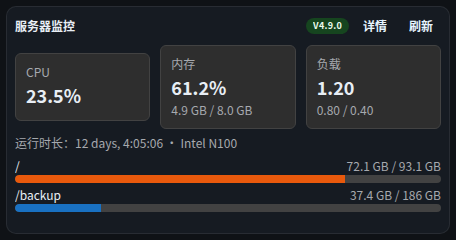

# 组件 · 服务器监控

> 层级：页面 → 组件 → 按钮。约定见 [../README.md](../README.md)；问题见 [../00-issues.md](../00-issues.md)。
> FR：打通 Glances 等第三方监控源，**只做连接与展示**（D36，不采集/不存储/不告警）。

**截图**：

## 配置（configSchema）

| 字段 | 类型 | 默认 | 说明 |
|---|---|---|---|
| `sourceId` | select（动态） | — | **监控源**（「数据源管理 · 数据连接」）——Q36：表单**只做选择**，连接信息（地址/认证）在连接里维护不重填；旧组件内联 props 仍兼容生效 |
| `refreshSec` | number | 60 | 标准刷新字段 |

> 空态（未配置连接且无旧内联配置）：「暂无监控源 —— 请到数据源管理·数据连接添加」+「去添加监控源」跳转（Q36）。

## 数据流

```
POST /api/widgets/data { type:"monitor", config:{ url, auth... } }
  ──► monitor connector（Glances /api/4/* 优先）──► CPU/内存/负载/磁盘/运行时长/型号
```

探活失败显式提示（不空白，D32 同款原则）。

## 结构

| 区块 | 内容 |
|---|---|
| 头部 | 「服务器监控」+ 版本徽标（如 `V4.9.0`）+「详情」+「刷新」 |
| 指标卡行 | CPU / 内存 / 负载 三张 `.wb-metric` 卡（数值大、辅助小字） |
| 概况行 | 运行时长 · CPU 型号 |
| 磁盘区 | 每盘：挂载点 + 进度条 + 已用/总量 |
| 弹层 | 监控原始指标（JSON） |

## 交互点

### 按钮 · 详情

- **触发**：弹窗「详情 · 监控原始指标（FR-I4）」——完整 JSON。
- **弹窗内**：「复制 JSON」按钮（点击 → 剪贴板 → 文案变「已复制」）；JSON 等宽（`.wb-code`）。

### 按钮 · 刷新

- **触发**：force 回源（FR-I3）。

### 磁盘进度条（展示型）

- **语义**：着色随使用率（低→蓝/中→橙/高→红，阈值由 connector 判定）；仅展示无操作。

## 状态与边界

| 状态 | 表现 |
|---|---|
| 探测中 | 「探测中…」 |
| 连接失败 | 黄色 `WbAlert`：「无法读取监控源：{原因}（D36：只做连接与展示）」 |
| 错误 | 红色 `WbAlert` |
| 空数据 | 各区块按有无字段显隐（如无 fs 则不显磁盘区） |

## 已知问题

⚠ **ISS-18（样式 P2）「运行时长」英文格式**：显示 `12 days, 4:05:06`（connector 直出英文串），与全站中文不一致，应本地化（「12 天 4 小时 5 分」）。
