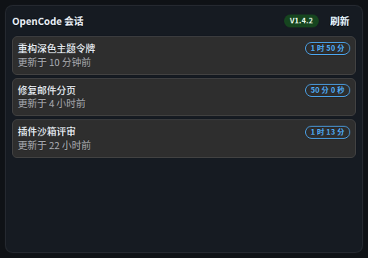

# 组件 · OpenCode

> ⚠️ **已退役（D66，2026-10-02）**：组件、connector 与 `opencode` 数据源类型已整体下线（用户指令）。
> 本篇为**历史存档**，描述退役前的行为；旧布局中的残留实例渲染为空卡（与插件卸载同语义），编辑态可移除。

> 层级：页面 → 组件 → 按钮。约定见 [../README.md](../README.md)；问题见 [../00-issues.md](../00-issues.md)。
> FR-E4：对接 opencode server HTTP API（experimental，**D32**：直接 HTTP 薄封装 + API 版本探测容错）。

**截图**：

## 配置（configSchema）

| 字段 | 类型 | 默认 | 说明 |
|---|---|---|---|
| `sourceId` | select（`data-source:opencode`） | — | **Q42**：只选「数据源管理 · 数据连接」已配置的连接；旧组件内联配置仍生效（兼容） |
| `limit` | number | 20 | 会话条数 |
| `refreshSec` | number | 60 | ≥10 标准刷新字段 |

> **Q42（用户反馈⑫一.2）**：连接信息（服务地址 / 访问令牌）从组件表单移除——在「数据源管理 · 数据连接」维护一次，组件只做选择（Q36 监控组件同款收口）。

## 数据流

```
POST /api/widgets/data { type:"opencode", config:{ sourceId → 合并连接配置（url, apiToken 引用）, limit } }
  ──► opencode connector：GET /api/... sessions + 版本探测
      响应形状变更 → probe.error 显式提示（不空白）
```

## 结构

| 区块 | 内容 |
|---|---|
| 头部 | 「OpenCode 会话」+ 连接徽标 +「刷新」 |
| 会话卡 | 名称 / 状态 / 耗时 /「更新于 {相对时间}」 |
| 弹层 | 会话详情（FR-I4） |

## 交互点

### 徽标 · 连接状态

- **绿** `v{版本}`（探测成功）/ 绿「已连接」（无版本号）/ **红**「探测失败」。
- **探测失败时**：黄色 `WbAlert`：「无法读取 opencode API：{原因}（实验性接口，版本不兼容时会在此提示）」——D32 显式提示原则。

### 按钮 · 刷新

- **触发**：force 回源。

### 会话卡（点击开详情）

- **逐步行为**：点击 → 详情弹窗：名称 / 状态 / 创建 · 更新（相对时间）。
- **状态与边界**：⚠ ISS-19（卡片键盘不可达）；详情信息量少（无会话日志/任务列表）——P2 级体验观察。

## 状态与边界

| 状态 | 表现 |
|---|---|
| 未选数据连接（旧组件未配 url） | 「配置后显示 opencode 会话」 |
| 探测中 | 「探测中…」 |
| 空态 | 「暂无会话」 |
| 错误 | 红色 `WbAlert` |

## 已知问题

⚠ ISS-19（逻辑 P2）卡片键盘不可达
