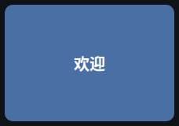

# 组件 · 占位组件 / 指标卡片（演示组件）

> 层级：页面 → 组件 → 按钮。约定见 [../README.md](../README.md)；问题见 [../00-issues.md](../00-issues.md)。
> 两者是零配置复杂度的展示组件（演示/分区标注用途）。

**截图**： · 

## 占位组件（placeholder）

### 配置

| 字段 | 类型 | 默认 | 说明 |
|---|---|---|---|
| `title` | text | 欢迎 | 显示标题 |
| `color` | text | `#4a6fa5` | 底色（**实例数据**，经 `--wb-placeholder-bg` 变量绑入，CSS 可覆盖 —— D39 契约） |

### 交互点

—— 无按钮；整卡纯展示（不可点击）。文字白色（对用户自选深/中性底色保 AA）。

## 指标卡片（stat-box）

### 配置

| 字段 | 类型 | 默认 | 说明 |
|---|---|---|---|
| `label` | text | — | 标签（上） |
| `value` | text | — | 数值（大） |

### 交互点

—— 无按钮；整卡纯展示。`.wb-metric--tile` 铺满格子（Q22a 反馈③修复：框与底色一致）。

## 状态与边界

两组件无数据请求、无加载/错误态；配置为空时显示空字符串/占位文案（title 默认「欢迎」）。

## 已知问题

——（本轮走查无新增）
