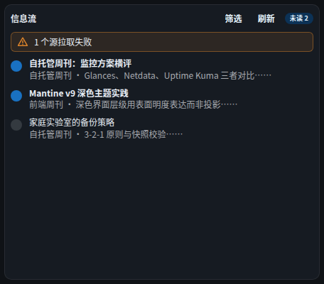

# 组件 · 信息流（RSS）

> 层级：页面 → 组件 → 按钮。约定见 [../README.md](../README.md)；问题见 [../00-issues.md](../00-issues.md)。
> FR：多源 RSS/Atom 聚合、摘要、未读标记归 Workspace（跨组件同步 FR-I6）、跳转原文。订阅管理在「数据源管理」（D40）。

**截图**：

## 配置（configSchema）

| 字段 | 类型 | 默认 | 约束 | 说明 |
|---|---|---|---|---|
| `limit` | number | 10 | ≥1 | **展示条数**（过滤后切片，Q22a 语义） |
| `filter` | select | `all` | 全部/仅未读 | 条目过滤 |
| `tagIds` | 组件内写回 | — | 标签多选 | 「筛选」= 按标签**选源**（D40） |
| `refreshSec` | number | 300 | ≥30 | 标准刷新字段 |

## 数据流

```
POST /api/widgets/data { type:"rss", config:{ limit, filter, tagIds } }
  ──► 服务端：选源（tagIds 过滤）→ 逐源拉取（独立容错）→ 按时间排序
    → 已读关联（feed_read）→ 先 filter 后 slice（条目数=展示条数）
POST /api/feeds/read { itemKey } ──► SSE ──► 全部组件已读态同步
```

## 结构

| 区块 | 内容 |
|---|---|
| 头部 | 「信息流」+「筛选」+「刷新」+「未读 N」徽标 |
| 列表 | 每行：已读圆点 / 标题 / 来源 · 摘要（truncate） |
| 弹层 | 文章详情（FR-I4） |
| 提示条 | 错误（拉取失败）/ 警告（N 个源拉取失败） |

## 交互点

### 按钮 · 筛选（按标签选源）

- **触发**：弹窗勾选标签 → 写回 `props.tagIds`（D28）→ **服务端只拉打标源**的条目。
- **状态与边界**：语义 = OR；不勾 = 全部源。与 Todo 的筛选按钮同组件（TagFilter）。

### 按钮 · 刷新

- **触发**：`force` 强制回源（FR-I3）；受最小间隔限流（5s）。

### 徽标 · 未读 N

- **语义**：全部未读数（非仅当前展示条，Q22a 修正口径）。
- **无障碍**：⚠ 与列表圆点一同缺语义标签（并入 ISS-19 类）。

### 列表行 · 标题（点击开详情）

- **逐步行为**：点击 → 未读则 `markRead`（SSE 同步）→ 打开详情弹窗。
- **详情弹窗**：标题 / 来源 · 相对时间（悬浮显绝对）/ 摘要（含 HTML 时走**沙箱 iframe** 渲染，D25/D30 禁脚本）/ 「阅读原文」新标签打开（`rel="noopener noreferrer"`）。
- **状态与边界**：⚠ ISS-19（键盘可达性）；摘要纯文本时保留换行。

### 警告条 · N 个源拉取失败

- **现象**：逐源容错，失败源计入 `errors[]`；UI 只显示**数字**。
- **⚠ ISS-16（逻辑 P2）**：无逐源详情入口（源名/错误因在数据里有，UI 不可见）——排障需看服务端日志。

## 状态与边界

| 状态 | 表现 |
|---|---|
| 加载中 | 「加载中…」 |
| 空态 | 「暂无条目」（或过滤后为空） |
| 错误 | `WbAlert`（error，sm） |
| 源失败 | `WbAlert`（warning，sm）计数（⚠ ISS-16） |

## 已知问题

⚠ ISS-16（逻辑 P2）拉取失败无逐源详情 · ⚠ ISS-19（逻辑 P2）标题点击键盘不可达
