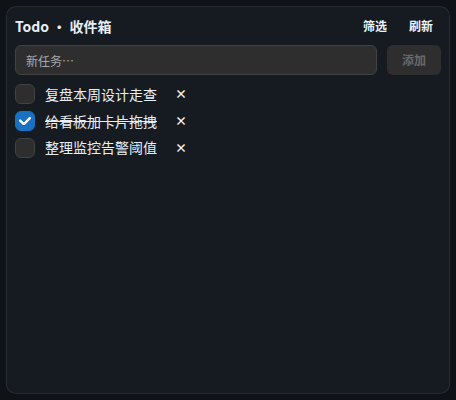

# 组件 · 个人 Todo

> 层级：页面 → 组件 → 按钮。约定见 [../README.md](../README.md)；问题见 [../00-issues.md](../00-issues.md)。
> FR：Workspace 级清单 + 条目（勾选/新增/删除），数据/视图分离（FR-D3 按标签选数据）。

**截图**：

## 配置（configSchema）

| 字段 | 类型 | 默认 | 约束 | 说明 |
|---|---|---|---|---|
| `name` | text（必填） | — | **全站唯一**（D43） | **卡片名称 = 任务分组名**：本卡片新建任务归入此名；重名在配置保存/添加时拒绝 |
| `filter` | select | `open` | 未完成/已完成/全部 | 条目过滤（Q29b 三档）；**归档项不在组件显示** |
| （标签） | — | — | — | Q29b：Todo 移除标签字段与筛选按钮（标签归信息源） |
| `refreshSec` | number | 60 | ≥10 | FR-I2 标准刷新字段 |

## 数据流

```
GET /api/todos?list=&tagIds= ──► 条目（含 tagIds）
POST/PATCH/DELETE /api/todos ──► SSE「todo」失效通知 ──► 全部 Todo 组件刷新（FR-I6）
```

服务端过滤（D40）：list + tagIds（OR）先过滤后返回。

## 结构

| 区块 | 内容 |
|---|---|
| 头部 | 标题「Todo · {分组显示名}」+「筛选」+「刷新」 |
| 新增行 | 「新任务…」输入 +「添加」 |
| 列表 | 每行：勾选框 / 标题 / 「×」删除 |
| 弹层 | 任务详情（FR-I4） |

## 交互点

### ~~按钮 · 筛选~~（Q29b 移除）

- **位置**：头部，「刷新」左侧。
- **前置**：浏览/编辑态均渲染；编辑态内容 inert（D38）故不可点。
> **已下线（Q29b）**：Todo 的「筛选 / 标签」按钮与字段已移除 —— 标签只用于信息源（RSS）；
> Todo 的显示口径为**三档**（未完成 / 已完成 / 全部，配置项「显示」）。下文为历史描述，仅存档。

### 按钮 · 刷新

- **触发**：`force` 强制回源（绕过服务端 TTL 缓存，FR-I3）。
- **逐步行为**：点击 → 按数据通道强刷 → 列表更新；无 loading 按钮态（列表区显「加载中…」仅首载）。
- **状态与边界**：受最小刷新间隔限流（5s），触发 429 时静默回落缓存。

### 输入框 · 新任务… + 按钮 · 添加

- **前置**：输入非空时「添加」才可用（disabled ✓）。
- **触发**：点击「添加」或输入框内 Enter。
- **逐步行为**：`POST /api/todos { title, list }`（title ≤500）→ 清空输入 → SSE 失效 → 列表刷新。
- **状态与边界**：trim 前空白忽略；⚠ ISS-21：无失败反馈（create 失败无提示，同 ISS-2 模式）。
- **无障碍**：Enter 提交 ✓。

### 列表行 · 归档（Q29b）

- **管理面**提供归档/恢复；组件不显示归档项（`includeArchived` 仅管理面）。

### 列表行 · 勾选框（完成/撤销完成）

- **触发**：点击 → `PATCH /api/todos/:id { done }` → SSE 同步全部组件（J4 双组件共享验证点）。
- **状态与边界**：~~ISS-14~~ ✅ 已修 —— 勾完出「已完成 1 项 · 撤销」条（6s 内可撤销，Q24a），且「显示」三档（Q29b）不再有「勾完即消失」问题。
- **无障碍**：`aria-label="toggle {标题}"` ✓。

### 列表行 · 标题（点击开详情）

- **触发**：点击 → 详情弹窗（FR-I4）：标题 / 分组+状态 / 创建·更新（相对时间，悬浮显绝对）。
- **状态与边界**：⚠ ISS-19：文本点击无键盘可达性（同 ISS-9 模式）。

### 按钮 · ×（删除，破坏性）

- **触发**：二次确认（D31/D34）：标题「删除任务？」，正文「确认删除任务『{标题}』？（不可恢复）」。
- **确认后**：`DELETE /api/todos/:id` → 清理标签关联（D40 应用层清理）→ SSE 同步。
- **数据边界**：删任务只删该条，不影响其它任务/清单（§1.3）。

## 状态与边界

| 状态 | 表现 |
|---|---|
| 加载中 | 「加载中…」小字 |
| 空态 | 「暂无任务」 |
| 错误 | `WbAlert`（error，sm）显示错误文案（Q19c 统一） |

## 数据边界（D43）

- 删除 Dashboard 上的卡片/页面 → **任务数据保留**（「数据源管理 · 任务」按卡片名称分组可见）；
- **删除分组才真删**：数据源管理分组「删除分组」= 真删该组全部任务（二次确认）。

## 已知问题

~~ISS-14~~ ✅ 已修（Q24a：完成后 6s 内可撤销）· ⚠ ISS-15（逻辑 P2）清单映射不一致 · ⚠ ISS-19（逻辑 P2）标题点击键盘不可达 · ⚠ ISS-21（逻辑 P2）新增失败无反馈
