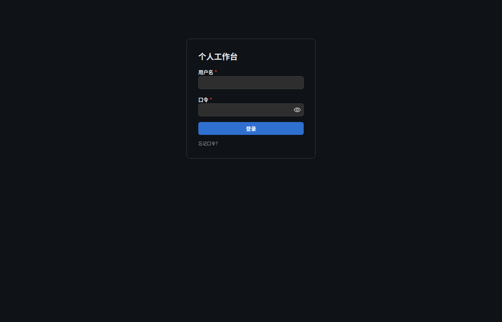

# 页面 · 登录页

> 层级：页面 → 组件 → 按钮。约定见 [../README.md](../README.md)；问题见 [../00-issues.md](../00-issues.md)。

**入口**：未登录访问任意路由即进入；登录成功后进入工作台页。
**截图**：`assets/p01-login`（初始）· `assets/p02-login-hint`（提示展开）· `assets/p03-login-error`（错误态）



## 页面结构

| 组件 | 位置 | 说明 |
|---|---|---|
| 登录卡片 | 视口居中偏上（`margin: 12vh auto`，宽 360px） | Mantine Paper：圆角 md + 描边 |
| 标题 | 卡片首行 | 「个人工作台」（⚠ ISS-8：无品牌图标，与头部不一致） |
| 登录表单 | 标题下 | 用户名 / 口令 / 登录按钮 / 忘记口令？ |
| 错误提示条 | 表单内、按钮上方（按需出现） | `WbAlert` error 档 |

## 组件 · 登录表单

### 字段 · 用户名

- **前置**：始终可见。
- **类型**：文本；`autocomplete="username"`（密码管理器自动填充）；`required`（浏览器原生校验）。
- **键盘**：Enter 提交表单（`<form onSubmit>`）；Tab 顺序：用户名 → 口令 → 登录 → 忘记口令？。
- **状态**：默认 / 输入中 / `disabled`（提交中随按钮 loading 禁用整个表单？——现状仅按钮 loading，输入框仍可编辑）。

### 字段 · 口令

- **类型**：密码（`PasswordInput`，带显示/隐藏切换）；`autocomplete="current-password"`；`required`。
- **键盘**：Enter 提交。
- **错误态**：认证失败不清空口令框（⚠ ISS-10：建议失败后聚焦并清空口令）。

### 按钮 · 登录

- **位置**：表单底部，主按钮（filled，全宽）。
- **前置条件**：始终可点；表单原生 `required` 校验通过才触发提交。
- **触发**：点击 / 表单内 Enter。
- **逐步行为**：
  1. `setBusy(true)` → 按钮进入 `loading` 态（防止重复提交）；
  2. `POST /api/auth/login { username, password }`；
  3. 成功：服务端下发 `sid` 会话 cookie（HttpOnly）→ `onLoggedIn()` → 父层 `GET /api/auth/me` 确认 → 进入工作台页；
  4. 失败：进入错误态（下）。
- **状态与边界**：默认 / loading（禁重复点击）；无其它禁用态。
- **错误态与恢复**：失败 → 表单顶部 `WbAlert`（error）显示服务端错误文案；`busy` 复位，可直接重试。⚠ ISS-1：更广的网络异常无专门处理。
- **无障碍**：`<button type="submit">`，Enter 可触发 ✓。
- **截图**：`assets/p03-login-error`（错误态）

### 交互点 · 忘记口令？

- **位置**：登录按钮下方，弱化文本（dimmed）。
- **触发**：点击切换展开/收起提示段（`hintOpen` state）。
- **逐步行为**：点击 → 标题下方出现提示文本：「管理员口令在部署时设置；遗忘时在服务器上修改后重启服务即可（详见部署文档）。」再次点击收起。
- **状态与边界**：仅本地 UI 状态，无请求。
- **无障碍**：⚠ ISS-9 —— 当前为 `<Text onClick>`（无 button 语义、不可 Tab 聚焦、无 aria-expanded），键盘/读屏不可达。
- **截图**：`assets/p02-login-hint`

## 页面状态机

| 状态 | 进入条件 | 表现 |
|---|---|---|
| 初始 | 进入页面 | 表单空 |
| 提交中 | 点击登录 | 按钮 loading |
| 错误 | 认证失败 | WbAlert 通栏 + 表单保留（⚠ ISS-10） |
| 提示展开 | 点「忘记口令？」 | 显示帮助文本 |

## 数据流

```
POST /api/auth/login ──► Set-Cookie: sid (会话)
GET /api/auth/me      ──► { username }（后续请求同 cookie 鉴权）
```

## 已知问题（本页走查）

⚠ ISS-8（样式 P2）品牌图标缺失 · ⚠ ISS-9（逻辑 P2）忘记口令？不可达 · ⚠ ISS-10（逻辑 P2）错误无字段级定位
