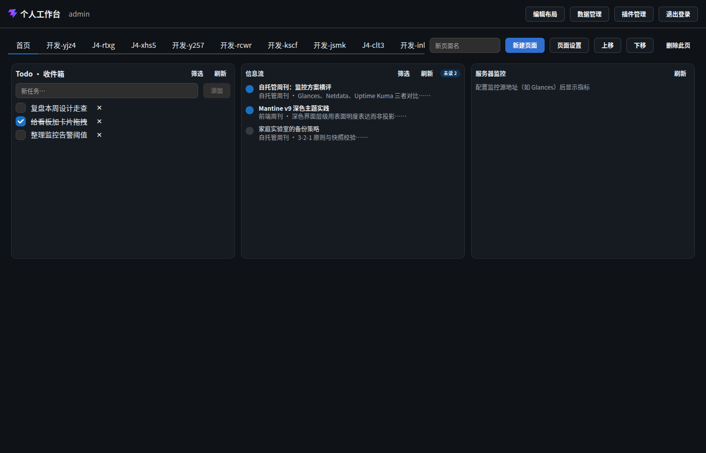

# 页面 · 工作台

> 层级：页面 → 组件 → 按钮。约定见 [../README.md](../README.md)；问题见 [../00-issues.md](../00-issues.md)。

**入口**：登录成功后；后续访问（会话有效）直达。
**截图**：`assets/p04-workspace-overview`（全览）· `assets/p05-workspace-header`（头部）· `assets/p06-workspace-tabbar`（页签/工具栏）· `assets/p07-confirm-delete-page`（删除确认）· `assets/p08-page-settings`（页面设置）

## 页面结构

| 组件 | 位置 | 说明 |
|---|---|---|
| 头部 | 页面顶部（AppShell.Header，高约 56px） | 品牌 + 当前用户 + 全局操作按钮组 |
| 页签栏 | 头部下方一行 | Dashboard 页签（横向滚动）+ 页面工具按钮 |
| 画布 | 主区域 | gridstack 网格，渲染活动页布局中的组件 |
| 弹窗层 | 叠层 | 页面设置 / 删除确认 / 数据源管理 / 插件管理（见 surfaces 篇） |

## 组件 · 头部

### 展示元素

| 元素 | 内容 | 说明 |
|---|---|---|
| 品牌图标 | `/favicon.svg`（18px） | 与登录页差异见 ⚠ ISS-8 |
| 品牌名 | 「个人工作台」 | verify-i6 以此文本断言工作台存在 |
| 当前用户 | 用户名（dimmed） | 只读 |

### 按钮 · 编辑页面 / 完成编辑（Q29d 改名）

- **位置**：头部右侧按钮组首个（**仅桌面端** ≥768px 渲染；移动端隐藏 → 见 ⚠ ISS-7 相邻问题、D10）。
- **前置条件**：桌面端始终可用。
- **触发**：点击切换布局编辑态（状态上提在 App：`layoutEdit`）。
- **逐步行为**：
  1. 进入编辑：按钮文案变「完成编辑」（filled 强调）→ 画布进入编辑态（见 [03-edit-mode.md](03-edit-mode.md)）；
  2. 退出编辑：触发 `flush()` **立即保存**未落盘布局（800ms 防抖之外的兜底）→ 回浏览态。
- **状态与边界**：两态翻转；编辑态切换不影响组件数据。
- **联动**：布局保存（FR-P4）；编辑态组件内容 inert（D38）。
- **截图**：`assets/p09-edit-mode`（编辑态）

### 按钮 · 数据源管理

- **位置**：顶栏（icon 按钮，Q68 起；**全端可见**，~~仅桌面端~~ 已随 D41 修正）。
- **触发**：跳转「数据源管理」**全页视图**（`?view=data` 深链，Q25c 起；不再是弹窗），顶栏「返回工作台」回到画布。
- **逐步行为**：切视图 → 按页签拉取对应数据（任务 / 信息源 / 看板 / 邮箱 / 数据连接 / 标签 / **图标**，共 7 页签；Q26/Q27/Q38b 扩容）。
- **状态与边界**：~~ISS-7~~ ✅ 已修（**D41**：数据操作 ≠ 布局编辑）；窄屏自适应。
- **联动**：数据/标签（D40）；变更经 SSE 同步全部组件（FR-I6）；`configError` 行会在编辑表单顶部显示「配置已损坏…」（SRV-07，Q100d）。

### 按钮 · 插件管理

- **位置**：「数据源管理」右侧（**仅桌面端**）。
- **触发**：打开插件管理弹窗（安装/启用/禁用/卸载/权限声明，详见 surfaces/plugin-admin.md —— Q23c）。

### 按钮 · 退出登录

- **位置**：头部最右（移动端唯一可见的头部按钮）。
- **触发**：`POST /api/auth/logout` → 销毁服务端会话 → 返回登录页。
- **状态与边界**：**无二次确认**（非破坏性——会话可重登，数据不动）；点击立即生效。
- **错误态**：无处理（网络失败时前端仍调用 `onLogout`？现状 `void api.logout().then(onLogout)` —— 失败则停留在工作台，无提示）。

## 组件 · 页面切换器（右上角弹层，Q27d 起；原「页签栏」已下线）

（历史截图：旧页签栏形态，仅存档）

- **入口**：顶栏右侧「当前页标题 ▾」按钮 → Popover 弹层（`aria-label="切换页面"`）。
- **列表**：`GET /api/dashboards`（按 `sortOrder`）；每行 `图标(可选) + 标题`，点击即切换。
- **切换**：`setActiveId` → 画布重挂载该页布局（`key={dashboardId}` 重置网格，D12 约定）；Board 卸载会 **flush 防抖中的布局改动**（unmount 兜底，不丢改动）。
- **状态与边界**：~~ISS-3~~ ✅ 已修（Q24b）—— `?page=<id>` 深链持久化，刷新停留原页。

### 弹层内页面管理（Q27d 一并收纳）

- **新建页面**：输入框 + Enter/按钮 → `POST /api/dashboards { title }` → 清空 → **自动切到新页**（J4 流程依赖此行为）。
  - 空名 → 按钮禁用（~~ISS-2~~ ✅ Q24b：原「静默无反馈」已修）；
  - 失败 → 顶部错误条（~~ISS-1~~ ✅ Q24b）；标题 ≤64（服务端 zod）。
- **上移 / 下移**：`moveActive(±1)` → `PATCH sortOrder`（逐页统一编号 0..n-1）；首/末行按钮禁用（~~ISS-5~~ ✅ Q24c）。
- **删除此页（破坏性）**：二次确认（D31/D34）——情境化标题「删除页面？」，正文含数据边界（§1.3）：「删除页面只移除布局与组件排布，业务数据（Todo/看板/邮件/凭证等 Workspace 数据）保留。确认删除页面『{标题}』？」；「确认」（红）/「取消」→ `DELETE /api/dashboards/:id` → 切到第一行；最后一页不显示删除入口。截图 `assets/p07-confirm-delete-page`。

### 内联页面设置（Q29d：弹窗取消 → 编辑态一行排开）

- **位置**：编辑页面时，布局**右上角一行**：页面名称 / 图标（emoji）/ 背景色 / **网格列数 / 网格行高（px）**（后两项 Q91/D58）。
- **保存**：**失焦即存**（`PATCH /api/dashboards/:id`，逐字段），无保存按钮。
- **入口**：页签切换器弹层中的「页面设置」已移除。

### ~~按钮 · 页面设置~~（Q29d 取消）

- **前置**：存在活动页（`disabled={!active}`）。
- **触发**：打开「页面设置」弹窗（`assets/p08-page-settings`）。
- **弹窗字段**：

| 字段 | 类型 | 说明 | 约束 |
|---|---|---|---|
| 页面名称 | 文本 | 页签标题 | 非空（trim），≤64 |
| 图标 | 文本（可选） | 页签前缀 emoji/字符 | 空 = 无图标 |
| 背景色 | 文本（可选） | 页面背景色（CSS 颜色） | 空 = 默认深色底 |

- **保存**：`PATCH /api/dashboards/:id` → 关弹窗 → 刷新。空名静默不保存（⚠ ISS-2）；失败无提示（⚠ ISS-1）。
- **取消**：直接关闭，不保存。

### 按钮 · 上移 / 下移

- **前置**：存在活动页（`disabled={!active}`）。
- **触发**：`moveActive(±1)` —— 本地数组换位后 `PATCH sortOrder`（逐页统一编号 0..n-1）。
- **状态与边界**：⚠ ISS-5 —— 首/末页边界点击静默无效（未按边界禁用）。
- **错误态**：⚠ ISS-1。

### 按钮 · 删除此页（破坏性）

- **前置**：存在活动页 **且** 页数 > 1（条件渲染；最后一页不显示删除）。
- **触发**：弹**二次确认**（D31/D34）。
- **确认弹窗**：
  - 标题（情境化）：「删除页面？」
  - 正文：「删除页面只移除布局与组件排布，业务数据（Todo/看板/邮件/凭证等 Workspace 数据）保留。确认删除页面『{标题}』？」（数据边界说明 = §1.3）
  - 按钮：「确认」（红）/「取消」
- **确认后**：`DELETE /api/dashboards/:id` → 活动页切到第一行 → 刷新。
- **错误态**：⚠ ISS-1。
- **截图**：`assets/p07-confirm-delete-page`

## 组件 · 画布（布局容器）

- **渲染**：gridstack 网格按 `layoutJson` 还原组件（位置 x/y/w/h + component + props）。
- **自动保存（FR-P4）**：任意布局变更 → 800ms 防抖 → `PUT /api/dashboards/:id/layout`；工具栏「保存中…」指示（dirty 态）。
- **失败**：错误条「布局保存失败，稍后自动重试」——~~ISS-4~~ ✅ 已修（Q24a）：真·退避自动重试 5s→10s→30s 封顶。
- **响应式（D12/D39/D58）**：断点按**页面列数** `N → N/2 → N/4 → 1`（Q91 起 N 可配 12–32；移动端单列全宽、仅浏览）。
- **SSE（FR-I6）**：数据变更（Todo/看板/邮件/订阅）推送到全部组件；断线 30s 轮询兜底。

## 已知问题（本页走查）

~~ISS-1/2/3/5/7~~ ✅ 已修（Q24b/c + D41）
