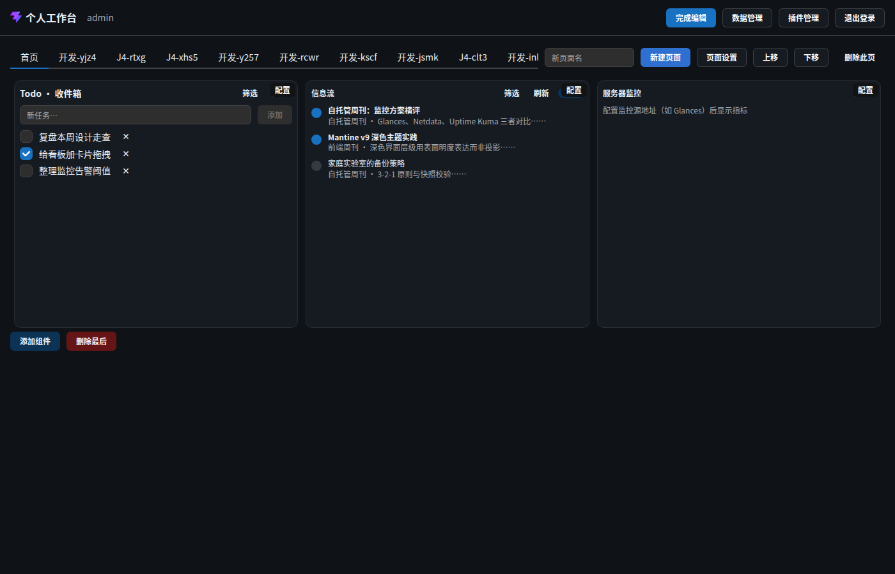
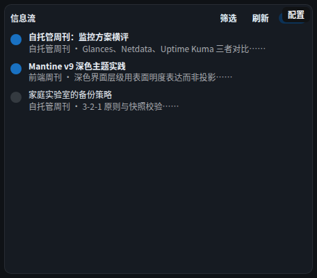

# 页面 · 编辑态（布局编辑模式）

> 层级：页面 → 组件 → 按钮。约定见 [../README.md](../README.md)；问题见 [../00-issues.md](../00-issues.md)。
> 语义核心（**D38**）：**编辑 = 只动布局；浏览 = 组件内操作**。

**入口**：工作台头部「编辑布局」（仅桌面端）。
**截图**：`assets/p09-edit-mode`（编辑态全览）· `assets/p10-edit-toolbar`（编辑工具栏）· `assets/p11-edit-hover-handle`（hover 显缩放手柄）· `assets/p12-mobile-browse`（移动端只读）

## 进入 / 退出

| 动作 | 时序 |
|---|---|
| 进入 | 头部「编辑布局」→ `layoutEdit=true` → Board 侧 `grid.enableMove/enableResize` 打开（不动 options，避免 `load(children)` 重置布局 —— D12 结论）→ 组件内容层 `inert`（D38）→ 组件外框现「配置」入口 |
| 退出 | 「完成编辑」→ `editMode` true→false 转移触发 **flush 立即保存** → 回浏览态，inert 解除 |

- **移动端**：头部不渲染切换按钮（D10）；`canEdit=false` 时编辑态无效。⚠ ISS-7（数据管理入口缺失同因）。
- **保存指示**：编辑中变更后工具栏显示「保存中…」（dirty 态），落盘后消失。

## 组件 · 编辑工具栏

工具栏在网格内侧（GridStack children，D12 wrapper 约束），仅编辑态显示完整工具。

### 按钮 · 添加组件

- **前置**：编辑态。
- **触发**：打开**组件选择器**弹窗（清单 = 内置 manifest + 启用中插件 manifest，J8；详见 surfaces/widget-picker.md —— Q23c）。
- **逐步行为**：点「添加组件」→ 选择器弹窗 → 选组件 → configSchema 表单预填默认值 → 「确认添加」→ 新组件入网格末位（`gs-id` 唯一）→ 布局进入防抖保存。
- **状态与边界**：同类型组件可多开；组件最小尺寸由 manifest `minSize` 约束。
- **联动**：添加后立即可拖动/缩放；保存走 FR-P4 防抖。

### 按钮 · 删除最后

- **前置**：编辑态。
- **触发**：删除网格中**最后一个**组件（`getGridItems()` 末项）。
- **逐步行为**：点击 → `removeWidget(last)` → 布局变更 → 防抖保存。**无确认**（D31 豁免：布局编辑内移除组件不动业务数据）。
- **状态与边界**：⚠ **ISS-6（逻辑 P1）语义错位** —— 删除目标是"最后添加/排列末位"而非"用户所指"，画布无选中概念，误删成本高。
- **期望形态**：逐组件「移除」按钮（WidgetChrome 上，点谁删谁）或选中态 + 删除选中。
- **截图**：`assets/p10-edit-toolbar`

## 组件 · 组件外框（WidgetChrome，编辑态）

每个组件在编辑态获得统一外框（浏览态/移动端隐藏）：

| 元素 | 行为 |
|---|---|
| 「配置」按钮 | 打开该实例的 configSchema 表单（改 props，D28 写回 + 手动保存）；**编辑态唯一可操作的组件级入口**（内容 inert 但配置在外层，D38） |
| 拖拽移动 | 抓住组件任意非交互区拖动 → gridstack 占位预览 → 落位（≥50% 碰撞规则，D12 结论） |
| 缩放手柄 | 右下角 SE 手柄；**hover 才显现**（autohide）——⚠ ISS-11：无引导说明 |
| 内容层 | `inert + pointer-events:none`（D38）：勾选、输入、点击全部不可达，防误操作 |

- **移动手势**：编辑态仅布局拖拽；组件内拖拽（如看板卡片）让位（D29 模式互斥）。
- **截图**：`assets/p11-edit-hover-handle`

## 手势规则总表（D29/D38）

| 场景 | 编辑态 | 浏览态 |
|---|---|---|
| 组件整体 | 拖动/缩放布局 | 固定 |
| 看板卡片 | 不可拖（inert） | HTML5 DnD 拖卡片（整列落点 + 占位框） |
| 组件内操作（勾选/输入/点击） | 禁止（inert） | 可用 |
| 「配置」入口 | 可用 | 不显示 |
| 触控（移动端） | 不适用（D10 禁编辑） | 组件内操作可用（触控 ≥44px，NFR2） |

## 移动端（D10 / NFR2）

- 无「编辑布局」入口；画布 `enableMove/enableResize` 关闭；组件无外框。
- ≤480px 单列全宽（D39）；触控目标 ≥44px（NFR2 强制下限）。
- 「数据管理」移动端可达（**D41**）；本节的桌面限定仅指布局编辑与插件管理。
- **截图**：`assets/p12-mobile-browse`

## 已知问题（本节走查）

~~ISS-4~~ ✅ 已修（Q24a：真·退避重试）· ~~ISS-6~~ ✅ 已修（Q24a：外框「移除」）· ⚠ ISS-11（样式 P2）编辑态无操作引导
