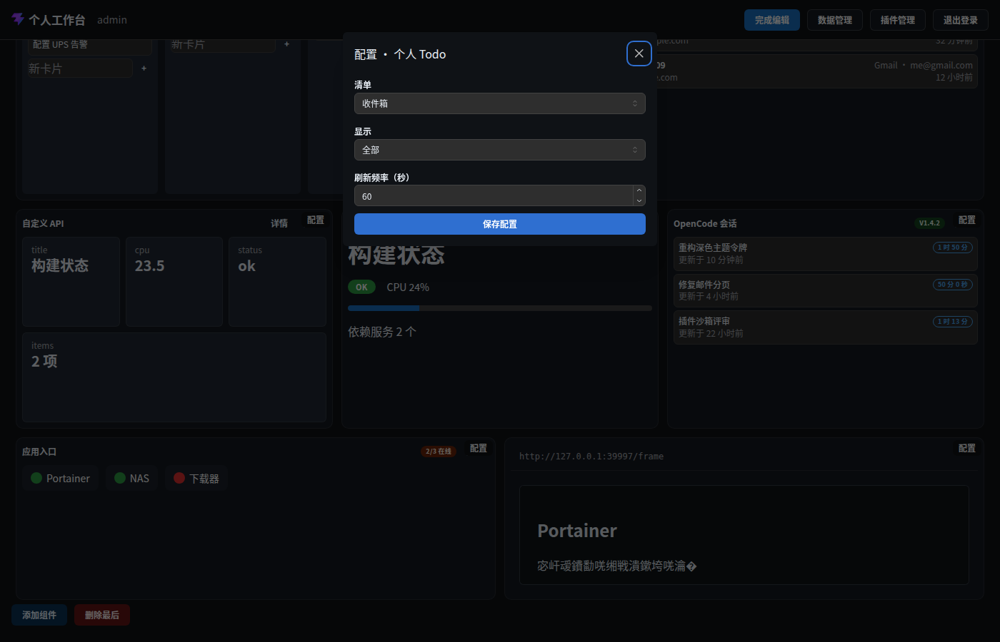

# 交互面 · 配置表单（configSchema 驱动）

> 层级：页面 → 组件 → 按钮。约定见 [../README.md](../README.md)；问题见 [../00-issues.md](../00-issues.md)。
> FR-W2：configSchema 自动生成配置表单；FR-W4：配置变更生命周期。

**入口**：① 组件选择器「配置段」（添加）；② 编辑态组件外框「配置」（改现有实例）。
**截图**：

## 字段类型 → 控件映射

| schema 类型 | 控件 | 说明 |
|---|---|---|
| `text` | TextInput | `required` 服务端+客户端双校验；`placeholder/help` 显示 |
| `number` | NumberInput | 仅接受数字；清空 = undefined |
| `select` | Select | `options: [{value,label}]` |
| `textarea` | Textarea | 多行（如 JSX 模板） |
| `json` | JsonInput | JSON 校验（如 itemsJson） |
| `secret` | PasswordInput | **入凭证库**（SEC3）；编辑时留空 = 不改，配置存凭证引用 |

通用字段：`refreshSec`（FR-I2 标准刷新字段，minRefreshSec 约束）出现在声明 `refresh` 能力的组件表单尾部。

## 交互点

### 按钮 · 确认添加 / 保存

- **触发**：`validateForm(schema, values)` → 通过则提交。
- **逐步行为**（编辑现有实例）：组装 props（secret 未改动时**保留原凭证引用**，SEC3 不重复入库）→ `grid.update(node, { props })` → 手动保存布局（FR-W4：props-only 更新不触发 change 事件）。
- **错误态**：⚠ ISS-23（逻辑 P2）——校验失败用浏览器 `alert()` 列错误（阻塞式、样式突兀，与站内 WbAlert 规范不一致）。
- **联动**：变更后组件重挂载取数；SSE 无关（配置非数据）。

### 按钮 · 取消

- **触发**：关闭弹窗，不保存（条件挂载，关闭态不留空 root —— Q4 教训）。

## 状态与边界

| 状态 | 表现 |
|---|---|
| 添加态 | 默认值预填 |
| 编辑态 | 现值预填（secret 显示占位） |
| 校验失败 | 浏览器 alert（⚠ ISS-23） |

## 已知问题

⚠ ISS-23（逻辑 P2）alert 校验提示
