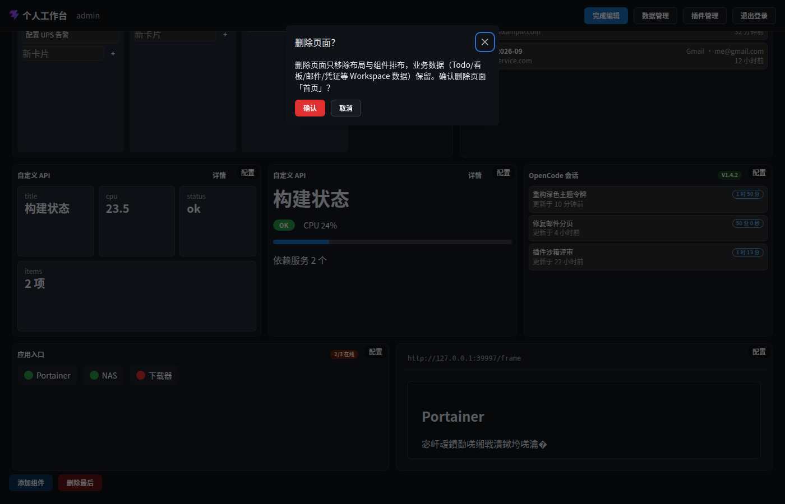

# 交互面 · 确认弹窗（破坏性操作二次确认）

> 层级：页面 → 组件 → 按钮。约定见 [../README.md](../README.md)；问题见 [../00-issues.md](../00-issues.md)。
> **D31/D34**：删除页面/列/卡片/任务/账号、卸载插件、退订一律二次确认；正文顺带说明数据边界（§1.3）。**唯一豁免** = 布局编辑内移除组件。

**入口**：所有 `ConfirmAction` 触发按钮（「删除此页」「×」「退订」「删除」「卸载」等）。
**截图**：

## 统一形态

| 元素 | 规范 |
|---|---|
| 标题 | **情境化短问句**（P2-8 修复）：「删除页面？」「删除列？」「删除卡片？」「删除任务？」「删除账号？」「卸载插件？」「确认退订？」；缺省「确认操作」 |
| 正文 | 动作后果 + 数据边界说明（如「删除页面只移除布局与组件排布，业务数据……保留」）+ 点名对象 |
| 按钮 | 「确认」（红）/「取消」（default）；按钮文本**精确固定**（自动化契约） |
| 挂载 | 按需挂载（关闭态不留空 root —— Q4；⚠ 但空 root 仍可能由其它路径产生，见 ISS 索引「弹窗作用域」） |

## 交互点

### 按钮 · 确认

- **触发**：执行 `onConfirm`（真实删除/卸载/退订）→ 关弹窗。
- **逐步行为**：服务端删除 → 关联清理（如删 Todo 清标签关联，D40）→ SSE 同步 → 相关组件刷新。
- **错误态**：⚠ ISS-1 同模式 —— 各调用点对删除失败无统一提示。

### 按钮 · 取消

- **触发**：仅关弹窗，零副作用。

### 键盘

- Esc 关闭（Mantine Modal 默认）；Tab 焦点圈在弹窗内。

## 确认点清单（全站）

| 触发按钮 | 标题 | 位置 |
|---|---|---|
| 删除此页 | 删除页面？ | 工作台页签栏 |
| ×（任务行） | 删除任务？ | Todo 组件 / 数据源管理 |
| ×（列头） | 删除列？ | 看板组件（正文含将删卡片数） |
| 删除（卡片弹窗） | 删除卡片？ | 看板卡片编辑 |
| 退订 | 确认退订？ | 数据源管理·信息源 |
| 删除（账号行） | 删除账号？ | 邮件·管理账号 |
| 卸载 | 卸载插件？ | 插件管理 |
| ×（标签行） | 删除标签？ | 数据源管理·标签 |

## 已知问题

——（形态规范已收口；删除失败的错误处理统一归 ISS-1 批）
