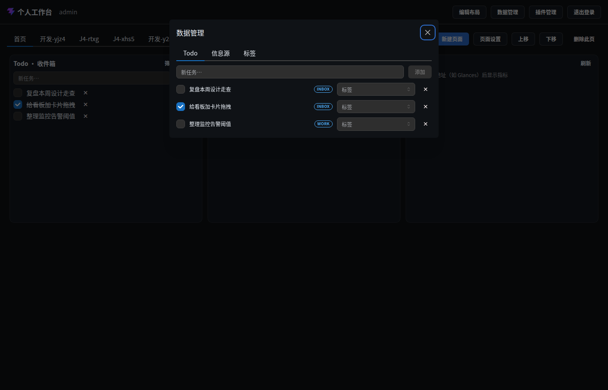
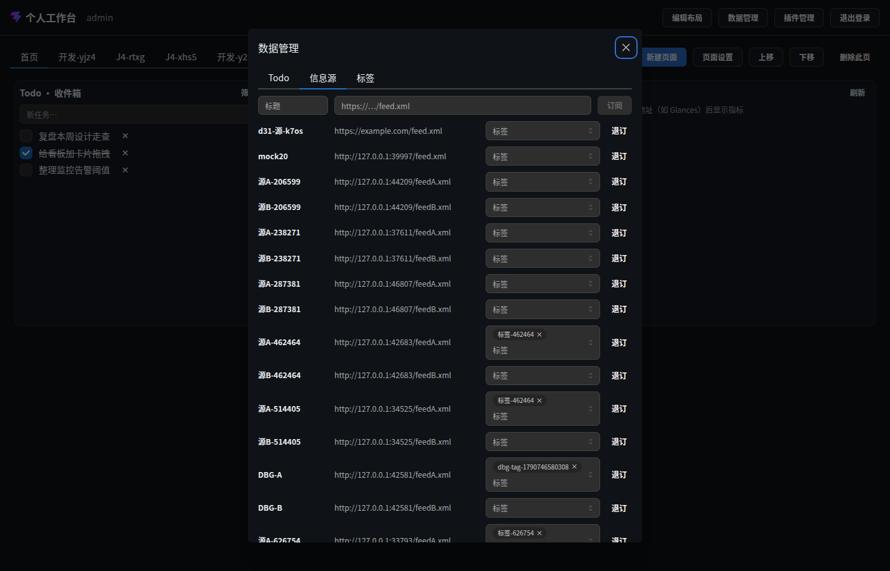
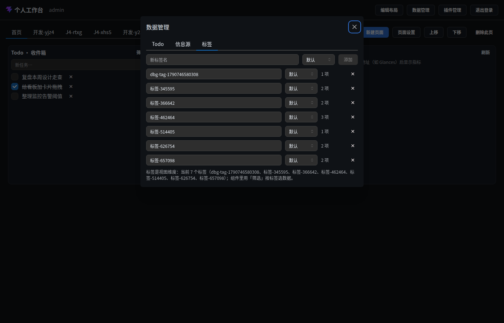

# 交互面 · 数据管理（Workspace 数据 + 标签）

> 层级：页面 → 组件 → 按钮。约定见 [../README.md](../README.md)；问题见 [../00-issues.md](../00-issues.md)。
> **FR-D2/D40**：Todo / 信息源 / 标签的统一管理处；卡片只做视图（数据/视图分离）。

**入口**：头部「数据管理」（全端可达，**D41**）。
**截图**： ·  · 

## 三页签总览

| 页签 | 管理对象 | 能力 |
|---|---|---|
| Todo | 任务（全部清单） | 新增 / 勾选完成 / 打标签 / 删除（确认） |
| 信息源 | RSS 订阅源 | 订阅 / 打标签 / 退订（确认） |
| 标签 | 标签 | 新建（带色）/ 重命名 / 改色 / 删除（确认）+ 使用计数 |

## 交互点 · Todo 页签

### 输入框 · 新任务… + 按钮 · 添加

- **逐步行为**：Enter/点击 → `POST /api/todos`（默认清单 inbox）→ 列表刷新 + SSE。
- **⚠ ISS-21**：空名静默（同组件内模式）。

### 行 · 勾选框 / 标题 / 清单徽标 / 标签多选 / ×

- **勾选框**：toggle done（SSE 同步）。
- **清单徽标**：显示原始键名（⚠ ISS-15：如 `inbox`，应显「收件箱」）。
- **标签多选（MultiSelect）**：勾选即 `PUT /api/tags/targets`（覆盖式保存）→ 失效标签计数与列表。
- **×**：确认「删除任务？」→ 删除 + 清标签关联。

## 交互点 · 信息源页签

### 输入行 · 标题 + URL + 按钮 · 订阅

- **逐步行为**：`POST /api/feeds` → 列表刷新；失败 → 顶部 `WbAlert`（error）。

### 行 · 标题 / URL / 标签多选 / 按钮 · 退订

- **退订**：确认「确认退订？」（正文：已读标记保留、可随时重新订阅）→ `DELETE /api/feeds/:id`。

## 交互点 · 标签页签

### 输入行 · 新标签名 + 颜色 + 按钮 · 添加

- **逐步行为**：`POST /api/tags { name, color }` → 列表刷新；同名 → 409 → `WbAlert` 显示。

### 行 · 名称（失焦重命名）/ 颜色下拉 / 计数 / ×

- **重命名**：输入框失焦提交 `PATCH`（未改不动）。
- **颜色下拉**：默认/蓝/绿/橙/红/紫/青 → `PATCH`。
- **计数**：`targetCount`（使用中的数据项数）。
- **×**：确认「删除标签？」（正文：仅移除标签与关联，数据保留 —— FR-D4）→ `DELETE`（FK 级联删关联）。

## 状态与边界

| 状态 | 表现 |
|---|---|
| 空态 | 「暂无任务 / 暂无订阅源 / 暂无标签 —— 新建后即可给 Todo 与订阅源打标」 |
| 错误 | 顶部 `WbAlert`（error，sm） |
| 长列表 | ⚠ ISS-26：无搜索/分页，全量平铺 |

## 已知问题

~~ISS-7~~ ✅ 已修（D41）· ~~ISS-15/21/26~~ ✅ 已修（Q24b/c）
