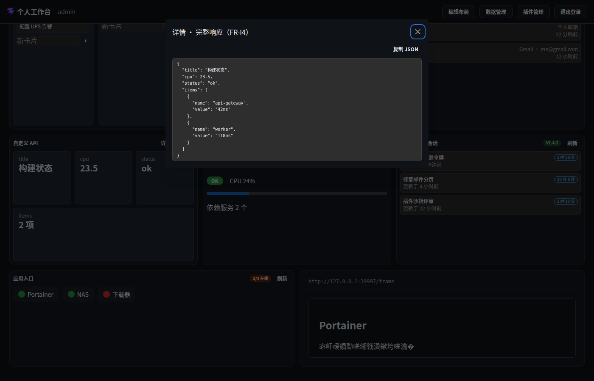

# 交互面 · 详情弹窗（FR-I4 组件内查看）

> 层级：页面 → 组件 → 按钮。约定见 [../README.md](../README.md)；问题见 [../00-issues.md](../00-issues.md)。
> **FR-I4**：组件内查看详情（抽屉/弹层）；`capabilities.detail` 声明。

**截图**：

## 弹窗族谱

| 弹窗 | 入口 | 内容 | 特殊 |
|---|---|---|---|
| 任务详情 | Todo 行标题 | 标题/清单+状态/创建·更新（相对时间） | — |
| 文章详情 | RSS 行标题 | 标题/来源·时间/摘要/「阅读原文」 | 摘要含 HTML → **沙箱 iframe**（D25/D30） |
| 监控原始指标 | 监控「详情」 | 完整 JSON +「复制 JSON」 | 等宽 `.wb-code` |
| 完整响应 | 自定义 API「详情」 | 完整 JSON +「复制 JSON」 | 等宽 `.wb-code` |
| 会话详情 | OpenCode 会话卡 | 名称/状态/创建·更新 | — |
| 邮件详情 | 邮件卡片 | 发件人·时间·账号 + 沙箱正文 | 不可信 HTML（D30） |

## 交互点

### 按钮 · 复制 JSON（监控 / 自定义 API）

- **触发**：`navigator.clipboard.writeText(JSON)` → 文案变「已复制」。
- **⚠ ISS-25（逻辑 P2）**：状态不复位（`copied` 置真后永驻「已复制」），二次复制无反馈区分；且 clipboard API 失败（非 https/权限）无回退提示。
- **期望**：2s 后复位或复制失败显式提示。

### 按钮 · 阅读原文（RSS）

- **触发**：新标签打开原文（`rel="noopener noreferrer"`）。

### 沙箱正文（RSS / 邮件）

- **安全**：iframe `sandbox` deny-all + CSP 禁脚本/禁远程图（D25/D30）；不可信 HTML 永不进主 DOM。

### 通用

- 关闭：右上 × / Esc / 遮罩（Mantine Modal 默认）。
- 弹窗按需挂载（关闭不留空 root）。

## 已知问题

⚠ ISS-25（逻辑 P2）复制状态不复位/无失败回退
