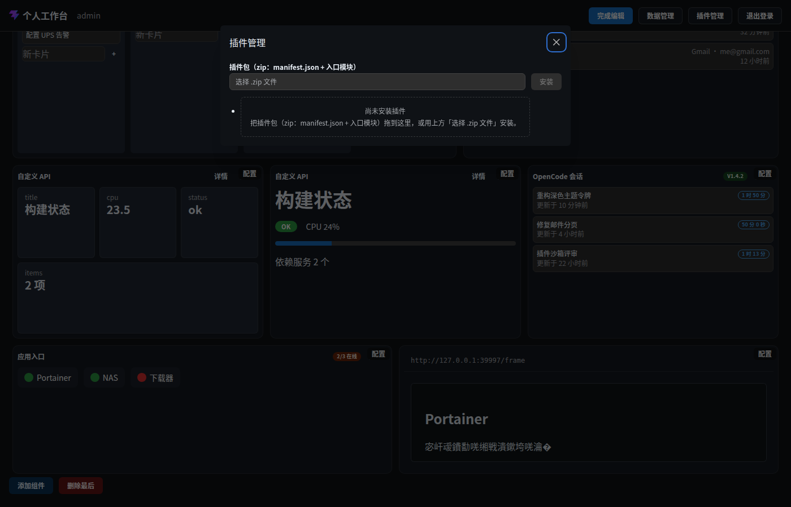

# 交互面 · 插件管理（FR-W6）

> 层级：页面 → 组件 → 按钮。约定见 [../README.md](../README.md)；问题见 [../00-issues.md](../00-issues.md)。
> **D24** ABI 契约 · 安装 = 解包落盘 + 登记 · 卸载不动业务数据（§1.3）。

**入口**：头部「插件管理」（仅桌面端）。
**截图**：

## 结构

| 区块 | 内容 |
|---|---|
| 安装行 | 「插件包（zip：manifest.json + 入口模块）」FileInput +「安装」 |
| 拖放区 | 空态时显示：说明 + 拖 zip 即入 FileInput（Q19d） |
| 消息条 | 安装/卸载结果（⚠ ISS-24：旧式红/绿文本，非 WbAlert） |
| 插件列表 | 每行：名称 / 版本 / 状态徽标 / 权限声明 / 启用·禁用 / 卸载 |

## 交互点

### 输入 · 选择 .zip 文件 + 拖放区

- **触发**：FileInput 选文件，或拖 zip 到虚线拖放区（drop → 填入 FileInput）。
- **约束**：`accept=".zip,application/zip"`。

### 按钮 · 安装

- **前置**：已选文件且非忙（`disabled={!file || busy}`）。
- **逐步行为**：`POST /api/plugins`（multipart）→ 服务端解析：条目名安全（拒绝对路径/穿越/隐藏段）、条目数与解压体积限额（防 zip bomb）、manifest 走 `validatePluginManifest`（**D24**：entry 包内相对路径、apiVersion semver、权限白名单）、拒绝内置类型占用、apiVersion 主版本兼容（HOST_API_VERSION）→ 落盘 `dataDir/plugins/<type>-<id>/` + 登记。
- **错误态**：逐条报错（校验拒绝原因）显示在消息条（⚠ ISS-24：样式未统一）。

### 行 · 权限声明展示（FR-W7）

- **内容**：`permissions` 三类白名单可视化 —— `widgets.data`（可访问数据资源）/ `credentialKinds`（可用凭证类型）/ `actions`（可执行动作）。
- **性质**：只读展示（安装前用户可从 manifest 预知；此处为安装后复核）。

### 按钮 · 启用 / 禁用

- **逐步行为**：`PATCH /api/plugins/:id { status }` → 启用后 manifest 并入组件选择器（J8）；禁用后已添加实例失效但保留。

### 按钮 · 卸载（破坏性）

- **触发**：确认「卸载插件？」（正文：删除安装文件与登记；已添加的插件组件将失效）。
- **确认后**：`DELETE /api/plugins/:id` → 删目录 + 登记；**业务数据不动**（§1.3）。

## 状态与边界

| 状态 | 表现 |
|---|---|
| 空态 | 「尚未安装插件」+ 拖放区说明 |
| 安装中 | 「安装」按钮 busy/disabled |
| 结果消息 | ⚠ ISS-24：`Text` 红/绿，未走 WbAlert 统一规范（Q19c 漏项） |

## 已知问题

⚠ ISS-24（样式 P2）消息条未统一 WbAlert
