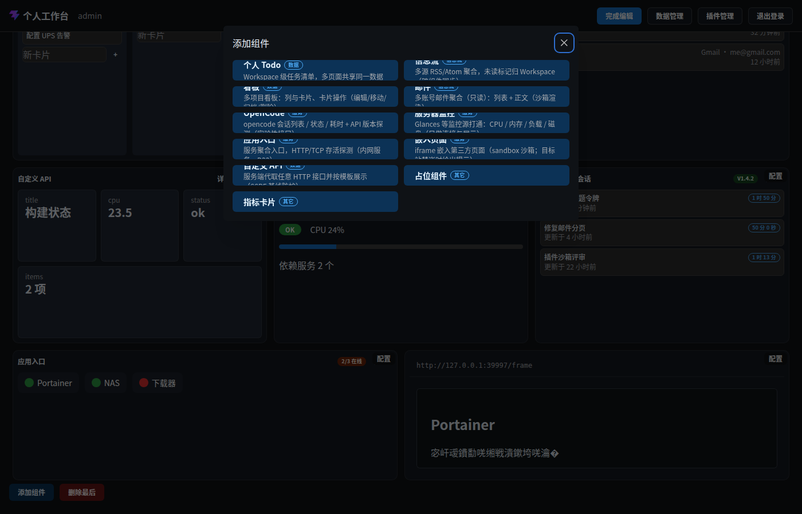

# 交互面 · 组件选择器（添加组件）

> 层级：页面 → 组件 → 按钮。约定见 [../README.md](../README.md)；问题见 [../00-issues.md](../00-issues.md)。
> FR-W2：manifest 清单驱动选择器（内置 + 启用中插件，J8）。

**入口**：编辑态工具栏「添加组件」。
**截图**：（⚠ 该图即 ISS-22 问题态证据）

## 结构与流程（两段式）

```
[清单段] 组件卡片网格（name + category 徽标 + 描述）
   │ 点卡片
   ▼
[配置段] configSchema 表单（默认值预填）+「← 返回」/「确认添加」
```

### 清单段 · 组件卡片

- **数据**：`builtinManifests` + 启用中插件 manifest 合并（按 category 分组展示）。
- **卡片内容**：名称 + 分类徽标（数据/服务/其它…）+ 描述。
- **触发**：点击 → 进入配置段（`selected` 状态）。
- **⚠ ISS-22（样式 P0）排版破损**：卡片用固定高度 Mantine `Button` 承载多行内容 —— **标题/徽标与描述文本重叠**（Q19a P0-3 原始问题，Q19b–d 修复清单漏项）。修法：改 `.wb-card--interactive` 语义容器（或 Button `h="auto"`）。

### 配置段 · 添加表单

- **字段**：该组件 configSchema 全字段 + 通用「刷新频率」（FR-I2）；默认值预填。
- **按钮 · ← 返回**：回清单段（保留已填内容）。
- **按钮 · 确认添加**：校验（⚠ ISS-23：校验失败用浏览器 `alert()`）→ 组件入网格末位 → 布局防抖保存。
- **secret 字段**：值入凭证库（SEC3），布局仅存引用。

## 状态与边界

| 状态 | 表现 |
|---|---|
| 空清单 | 理论不发生（内置 ≥11）；插件清单为空不影响内置 |
| 校验失败 | 浏览器 alert（⚠ ISS-23） |
| 重复添加 | 允许（同类型多实例，gs-id 唯一） |

## 已知问题

~~ISS-22~~ ✅ 已修（Q24a：语义卡容器）· ⚠ ISS-23（逻辑 P2）alert 校验提示
